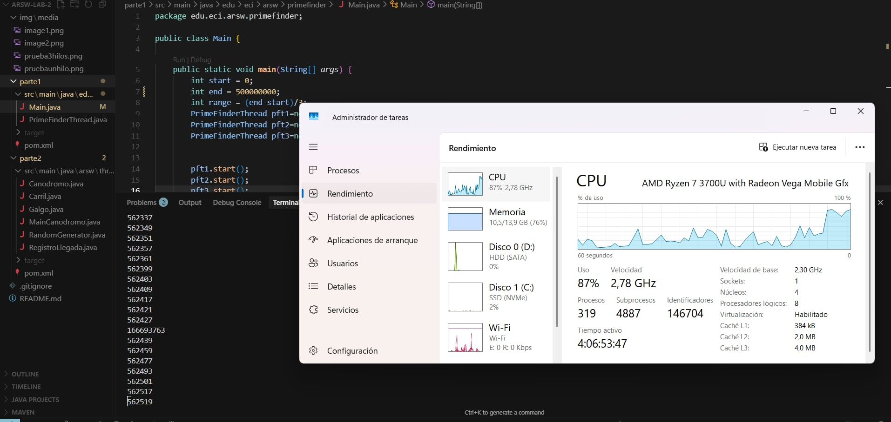
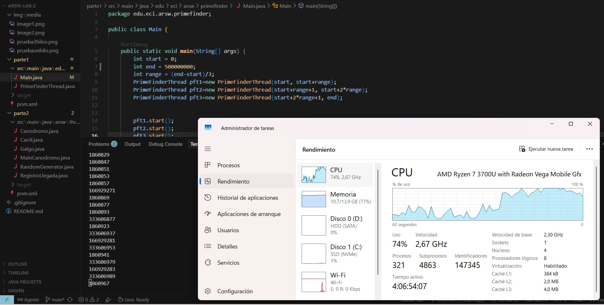
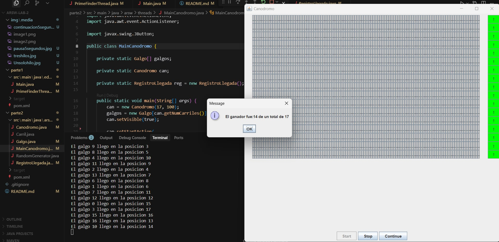
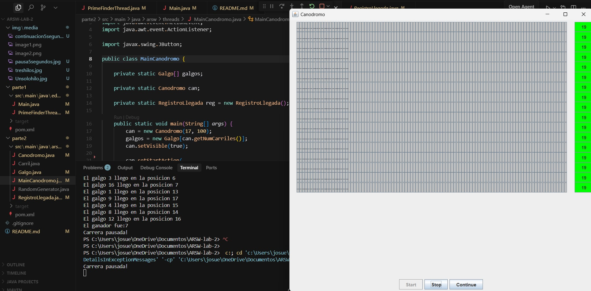

Escuela Colombiana de Ingeniería

Arquitecturas de Software – ARSW


## Autor: Josué Hernandez


#### Programación concurrente

#### Parte I

Creación, puesta en marcha y coordinación de hilos.

1. Revise el programa "primos concurrentes" (en la carpeta parte1), dispuesto en el paquete edu.eci.arsw.primefinder. Este es un programa que calcula los números primos entre dos intervalos, distribuyendo la búsqueda de los mismos entre hilos independientes. Por ahora, tiene un único hilo de ejecución que busca los primos entre 0 y 500.000.000. Ejecútelo, abra el administrador de procesos del sistema operativo, y verifique cuantos núcleos son usados por el mismo.

### Análisis del Punto 1: Ejecución con Un Solo Hilo

**Resultados del experimento:**
- **Tiempo de ejecución**: 40 minutos
- **Uso de CPU**: 87% con picos variables
- **Distribución**: La carga se concentra principalmente en un núcleo



**Uso del procesador:**
- El **87% de uso de CPU** no significa que se usen todos los núcleos
- Java asigna el hilo a un núcleo específico, pero el sistema operativo puede moverlo entre núcleos
- El alto porcentaje se debe a que ese núcleo trabaja intensivamente, mientras otros permanecen relativamente inactivos
- Los picos variables ocurren por la gestión del sistema operativo y otros procesos

**¿Por qué 40 minutos?**
- **Procesamiento secuencial**: Un solo hilo evalúa 500,000,000 números uno por uno
- **Cálculo intensivo**: El algoritmo `isPrime()` es computacionalmente costoso para números grandes
- **Limitación de paralelismo**: No se aprovecha la capacidad multi-núcleo del procesador AMD Ryzen 7 3700U (4 núcleos)

2. Modifique el programa para que, en lugar de resolver el problema con un solo hilo, lo haga con tres, donde cada uno de éstos hará la tercera parte del problema original. Verifique nuevamente el funcionamiento, y nuevamente revise el uso de los núcleos del equipo.

### Análisis del Punto 2: Ejecución con Tres Hilos

**Resultados del experimento:**
- **Tiempo de ejecución**: 24 minutos
- **Uso de CPU**: 74% más estable y distribuido
- **Distribución**: La carga se reparte entre múltiples núcleos



**¿Qué sucede técnicamente?**

**División del trabajo:**
- **Hilo 1**: busca primos de 0 a 166,666,666
- **Hilo 2**: busca primos de 166,666,667 a 333,333,332
- **Hilo 3**: busca primos de 333,333,333 a 500,000,000

**Uso del procesador:**
- **74% de uso promedio**: La carga se distribuye entre los 4 núcleos disponibles
- **Mayor estabilidad**: El uso es más constante porque múltiples núcleos trabajan simultáneamente
- **Mejor aprovechamiento**: Se utiliza efectivamente la arquitectura multi-núcleo

**¿Por qué 24 minutos (40% más rápido)?**

**Paralelismo real:**
- **División efectiva**: Cada hilo procesa ~166M números en lugar de 500M
- **Ejecución simultánea**: Los 3 hilos trabajan al mismo tiempo en núcleos diferentes
- **Reducción teórica**: 40 min ÷ 3 = 13.3 min (ideal), pero obtenemos 24 min

**¿Por qué no es exactamente 1/3 del tiempo?**

1. **Overhead de sincronización**: Crear y coordinar hilos tiene un costo
2. **Competencia por recursos**: Memoria caché, bus del sistema, etc.
3. **Desbalance de carga**: Los números más grandes requieren más tiempo para evaluar primalidad
4. **Límites del hardware**: El procesador tiene solo 4 núcleos físicos
5. **Sistema operativo**: Otros procesos también consumen recursos

**Ventajas del paralelismo:**
- **Mejor utilización**: Se aprovechan más núcleos simultáneamente
- **Escalabilidad**: El enfoque se puede extender a más hilos
- **Eficiencia mejorada**: 66% menos tiempo con solo cambios de software
3. Lo que se le ha pedido es: debe modificar la aplicación de manera que cuando hayan transcurrido 5 segundos desde que se inició la ejecución, se detengan todos los hilos y se muestre el número de primos encontrados hasta el momento. Luego, se debe esperar a que el usuario presione ENTER para reanudar la ejecución de los mismo.

### Análisis del Punto 3: Control de Pausa y Reanudación

**Funcionalidad implementada:**
- **Control temporal**: Pausa automática después de exactamente 5 segundos
- **Sincronización de hilos**: Detención coordinada de los 3 hilos trabajadores
- **Reporte de progreso**: Muestra el conteo parcial de primos por hilo
- **Interacción del usuario**: Espera entrada para reanudar la ejecución
- **Reanudación exacta**: Los hilos continúan desde donde se pausaron

**Ejecución en progreso:**



**Pausa automática a los 5 segundos:**



#### ¿Qué sucede técnicamente?

**Mecanismo de Sincronización:**

1. **Variables de control**:
   ```java
   private volatile boolean paused = false;
   private final Object pauseLock = new Object();
   ```
   - `volatile boolean paused`: Garantiza visibilidad entre hilos
   - `Object pauseLock`: Objeto dedicado para sincronización

2. **Verificación en cada iteración**:
   ```java
   synchronized(pauseLock) {
       while (paused) {
           pauseLock.wait();
       }
   }
   ```
   - Cada hilo verifica si debe pausarse antes de continuar
   - `wait()` libera el lock y pone el hilo en espera
   - No consume CPU mientras está pausado

3. **Control desde el hilo principal**:
   - `Thread.sleep(5000)`: Espera exactamente 5 segundos
   - `pauseThread()`: Activa la pausa en los 3 hilos
   - `resumeThread()`: Reactiva todos los hilos con `notifyAll()`

#### Análisis de los Resultados Obtenidos

**Distribución del trabajo a los 5 segundos:**
- **Hilo 1** (0 a 166,666,666): **36,272 primos** encontrados
- **Hilo 2** (166,666,667 a 333,333,332): **1,622 primos** encontrados  
- **Hilo 3** (333,333,333 a 500,000,000): **949 primos** encontrados
- **TOTAL**: **38,243 números primos** en 5 segundos

**¿Por qué esta distribución desigual?**

1. **Densidad de primos decrece**: Los números más pequeños tienen mayor densidad de primos
2. **Complejidad computacional**: Verificar si un número grande es primo toma más tiempo
3. **Teorema de números primos**: La probabilidad de que un número n sea primo es aproximadamente 1/ln(n)

**Ejemplo de densidad:**
- Rango 0-166M: ~36,272 primos (alta densidad)
- Rango 166M-333M: ~1,622 primos (densidad media)  
- Rango 333M-500M: ~949 primos (baja densidad)

#### Ventajas del Mecanismo Implementado

**Eficiencia:**
- **Sin busy-waiting**: Los hilos pausados no consumen CPU
- **Reanudación instantánea**: Los hilos continúan inmediatamente desde donde se quedaron
- **Sincronización segura**: No hay condiciones de carrera

**Precisión:**
- **Control temporal exacto**: Pausa a los 5 segundos exactos
- **Estado consistente**: Los conteos son precisos en el momento de la pausa
- **Reanudación exacta**: No se pierde trabajo realizado

**Escalabilidad:**
- **Funciona con N hilos**: El mecanismo se puede extender a cualquier número de hilos
- **Overhead mínimo**: El costo de sincronización es despreciable
- **Interactividad**: Permite control manual del usuario sobre la ejecución

Este mecanismo demuestra conceptos avanzados de programación concurrente como sincronización de hilos, wait/notify, y coordinación temporal en sistemas multi-hilo.

## Parte II - Simulador de Carreras de Galgos

### Descripción del Problema

El simulador de carreras de galgos es una aplicación gráfica donde 17 galgos compiten en una carrera de 100 metros. Todos los galgos tienen la misma velocidad de programación, por lo que el ganador depende del scheduling del procesador. Los galgos comparten acceso a un objeto `RegistroLlegada` que maneja las posiciones de llegada.

### Demostración de Funcionalidades Implementadas

**Funcionalidad de Pausa en Acción:**


**Análisis de la imagen:**
- **Estado**: Carrera pausada mediante el botón "Stop"
- **Consola**: Muestra "Carrera pausada!" confirmando la activación del mecanismo
- **Pista visual**: Los galgos se encuentran en diferentes posiciones de avance
- **Sincronización**: Todos los hilos están en estado `wait()` sin consumir CPU
- **Interfaz**: Los botones "Start", "Stop" y "Continue" están disponibles para control

**Resultados Finales Corregidos:**


**Análisis de la imagen:**
- **Ganador**: Galgo 14 declarado como único ganador (posición 1)
- **Posiciones únicas**: Cada galgo tiene una posición de llegada diferente y secuencial
- **Ranking completo**: Console muestra todas las posiciones desde la 1 hasta la 17
- **Sincronización correcta**: Resultados mostrados solo después de que todos los hilos terminaron
- **Sin condiciones de carrera**: No hay posiciones duplicadas ni inconsistencias

### Problemas Identificados y Soluciones

#### Problema 1: Sincronización Temporal Incorrecta

**¿Qué sucedía?**
- Los resultados se mostraban inmediatamente después de iniciar los hilos
- No se esperaba a que los galgos terminaran la carrera
- La interfaz mostraba ganadores antes de que la carrera finalizara

**Código problemático (MainCanodromo.java, línea 38):**
```java
for (int i = 0; i < can.getNumCarriles(); i++) {
    galgos[i] = new Galgo(can.getCarril(i), "" + i, reg);
    galgos[i].start();
}
can.winnerDialog(reg.getGanador(), reg.getUltimaPosicionAlcanzada() - 1);
```

**Solución implementada:**
```java
try {
    for (int i = 0; i < galgos.length; i++) {
        galgos[i].join();
    }
} catch (InterruptedException ex) {
    ex.printStackTrace();
}
can.winnerDialog(reg.getGanador(), reg.getUltimaPosicionAlcanzada() - 1);
```

#### Problema 2: Condiciones de Carrera en Posiciones

**¿Qué sucedía?**
- Múltiples galgos podían obtener la misma posición de llegada
- Varios galgos podían ser declarados "ganadores"
- El ranking mostraba inconsistencias como múltiples primeros lugares

**Código problemático (Galgo.java):**
```java
int ubicacion = regl.getUltimaPosicionAlcanzada();
regl.setUltimaPosicionAlcanzada(ubicacion + 1);
```

**Análisis de la condición de carrera:**
1. Galgo A lee `ultimaPosicionAlcanzada = 1`
2. Galgo B lee `ultimaPosicionAlcanzada = 1` (antes de que A actualice)
3. Galgo A escribe `ultimaPosicionAlcanzada = 2`
4. Galgo B escribe `ultimaPosicionAlcanzada = 2`
5. **Resultado**: Ambos galgos obtienen posición 1 (dos ganadores)

**Solución implementada:**
```java
public synchronized int obtenerPosicionLlegada() {
    int posicion = ultimaPosicionAlcanzada;
    ultimaPosicionAlcanzada++;
    return posicion;
}

int ubicacion = regl.obtenerPosicionLlegada();
```

#### Problema 3: Funcionalidades de Pausa/Continuar Inexistentes

**¿Qué sucedía?**
- Los botones "Stop" y "Continue" solo imprimían mensajes
- No había control real sobre la ejecución de los galgos
- No se podía pausar la carrera en progreso

**Solución implementada con wait/notify:**

**Variables de control:**
```java
private static volatile boolean pausado = false;
private static final Object pauseLock = new Object();
```

**Verificación en cada iteración:**
```java
public void corra() throws InterruptedException {
    while (paso < carril.size()) {
        synchronized(pauseLock) {
            while (pausado) {
                pauseLock.wait();
            }
        }
        Thread.sleep(100);
        carril.setPasoOn(paso++);
    }
}
```

**Métodos de control:**
```java
public static void pausarCarrera() {
    synchronized(pauseLock) {
        pausado = true;
    }
}

public static void reanudarCarrera() {
    synchronized(pauseLock) {
        pausado = false;
        pauseLock.notifyAll();
    }
}
```

### Conceptos de Programación Concurrente Aplicados

#### 1. **Thread.join() - Sincronización de Finalización**
- **Propósito**: Esperar a que un hilo termine antes de continuar
- **Uso**: Garantizar que todos los galgos terminen antes de mostrar resultados
- **Beneficio**: Sincronización temporal correcta

#### 2. **synchronized - Exclusión Mutua**
- **Propósito**: Garantizar acceso exclusivo a regiones críticas
- **Uso**: Proteger el contador de posiciones de llegada
- **Beneficio**: Operaciones atómicas, evita condiciones de carrera

#### 3. **wait() y notifyAll() - Comunicación entre Hilos**
- **wait()**: Libera el lock y pone el hilo en espera (no consume CPU)
- **notifyAll()**: Despierta todos los hilos que están en wait()
- **Uso**: Control de pausa/reanudación de todos los galgos simultáneamente

#### 4. **volatile - Visibilidad entre Hilos**
- **Propósito**: Garantizar que todos los hilos vean el valor más actualizado
- **Uso**: Variable `pausado` debe ser visible para todos los galgos
- **Beneficio**: Evita problemas de cache de CPU

### Ventajas de las Soluciones Implementadas

#### **Corrección funcional:**
- ✅ Resultados mostrados solo al finalizar todas las carreras
- ✅ Posiciones únicas y correctas para cada galgo
- ✅ Funcionalidades de pausa/continuar completamente operativas

#### **Eficiencia:**
- ✅ Hilos pausados no consumen CPU (usan `wait()` en lugar de busy-waiting)
- ✅ Sincronización mínima necesaria (solo en regiones críticas)
- ✅ Reanudación instantánea desde el punto exacto de pausa

#### **Robustez:**
- ✅ No hay condiciones de carrera
- ✅ Manejo correcto de excepciones
- ✅ Estado consistente en todo momento
- ✅ Capacidad de ejecutar múltiples carreras

### Flujo de Ejecución Corregido

```
1. [Inicio] → Click "Start" → Crear e iniciar 17 hilos galgo
2. [Carrera] → Galgos compiten, verificando pausa en cada paso
3. [Llegada] → Cada galgo obtiene posición única y atómica
4. [Sincronización] → join() espera que TODOS terminen
5. [Resultados] → Mostrar ganador y ranking correcto
6. [Reset] → Reactivar botón Start para nueva carrera

Controles durante la carrera:
- "Stop" → pausado = true → Todos los galgos entran en wait()
- "Continue" → pausado = false + notifyAll() → Todos se reanudan
```
Esta implementación demuestra el manejo completo de problemas comunes en programación concurrente y las técnicas estándar para resolverlos de manera elegante y eficiente.
